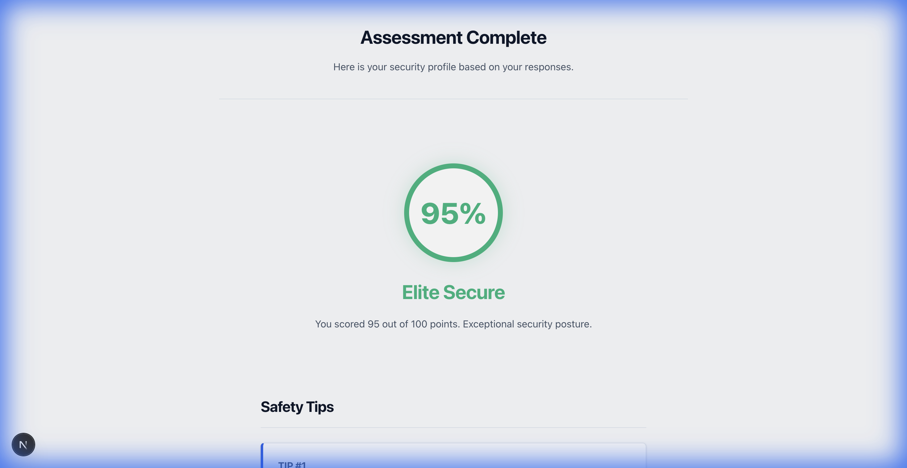
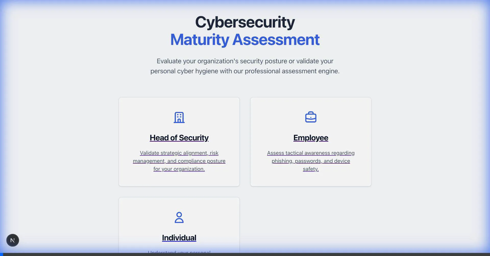
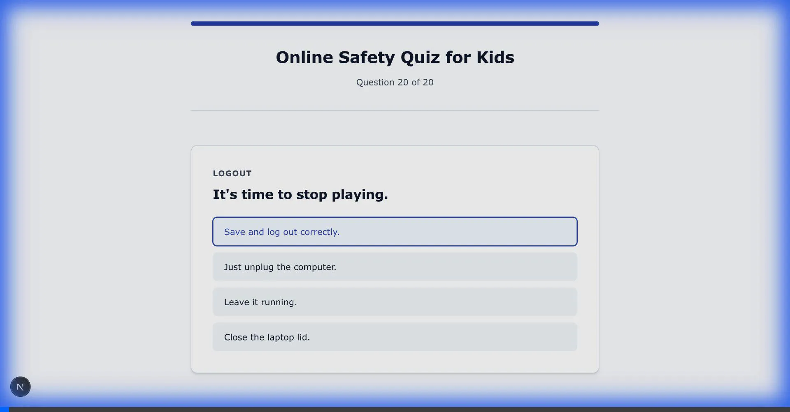
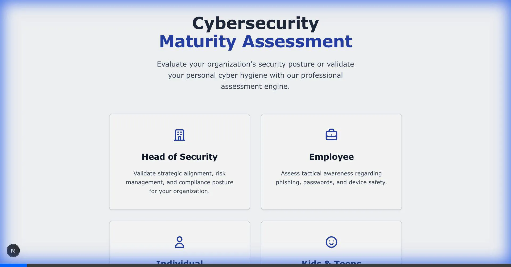

# Cybersecurity Maturity Assessment App

A professional-grade, multi-persona cybersecurity assessment platform designed to evaluate security posture across various demographics—from C-level executives to children.



## 📌 Scope & Features

This application is a comprehensive assessment engine built with **Next.js**. It provides tailored security questionnaires for four distinct personas:
1.  **Head of Security (Company)**: Strategic questions on Governance, Risk, and Compliance (GRC).
2.  **Employee**: Tactical questions on phishing, password hygiene, and device safety.
3.  **Individual**: Personal cybersecurity hygiene (home network, social media privacy).
4.  **Kids & Teens**: Age-appropriate questions on cyberbullying, stranger danger, and gaming safety.

### Key Highlights
-   **WCAG 2.2 AAA Compliant**: High-contrast design (Slate 900/White) and legible typography for maximum accessibility.
-   **Adaptive Feedback**: Provides actionable advice based on scores.
-   **Kids Mode**: Features simplified language and visual "Safety Tips" with emojis (🛡️, 🚫, 🤐).
-   **Data Persistence**: Automatically saves every assessment result as a unique, time-stamped JSON file.
-   **Professional UI**: sleek, modern "Executive" aesthetic with responsive glassmorphism effects.

## 🚀 Installation & Usage

1.  **Clone the repository**:
    ```bash
    git clone git@github.com:mr31labs/cybercheck.git
    cd cybercheck
    ```

2.  **Install dependencies**:
    ```bash
    npm install
    ```

3.  **Run the development server**:
    ```bash
    npm run dev
    ```

4.  **Access the app**:
    Open [http://localhost:3000](http://localhost:3000) in your browser.

## 📸 Verification & Demos

### 1. App Overview & Navigation
*Demonstration of the landing page and persona selection.*


### 2. Kids Persona Assessment
*Verifying the child-friendly interface, questions, and safety tips.*


### 3. Individual Assessment Flow
*Walkthrough of the personal security questionnaire.*


### 4. Data Persistence
*Verification of unique JSON file creation for every completed test.*


### 5. Accessibility Check (WCAG AAA)
*Verification of high-contrast text and clean UI (no underlines).*


---

## ⚠️ Production Disclaimer

> [!IMPORTANT]
> **This application is currently a robust prototype.**
>
> If you intend to use this application in a production environment, you **MUST integrate it with a secure database and backend system** (e.g., PostgreSQL, MongoDB, Firebase).
>
> Current limitations of the prototype:
> -   **Data Storage**: Results are saved to the local filesystem (`data/*.json`). In a production deployment (e.g., Vercel, AWS), these files will be ephemeral and lost on redeployment.
> -   **Security**: There is no user authentication or role-based access control.
> -   **Scalability**: File-based storage is not suitable for high-volume concurrent access.

---

## 🛠 Tech Stack
-   **Framework**: Next.js (React)
-   **Styling**: CSS Modules (Custom "Executive" Theme)
-   **Language**: JavaScript (ES6+)
-   **Data**: JSON (Local Filesystem)

Built by [Antigravity] for [User].
